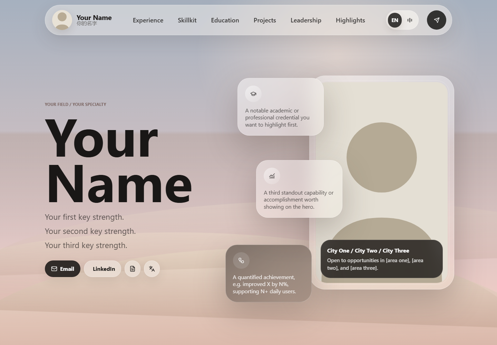

# Personal Homepage Template

A bilingual (English / Chinese) static personal homepage template — no build step, no framework. Just HTML, CSS, and a little vanilla JavaScript. Designed for showcasing yourself to employers, collaborators, and recruiters.

**[Live demo →](https://yizhixuanzhu.github.io/homepage-template/)**

## Features

- 🌐 **EN / 中 language toggle** — built-in bilingual support via a simple translation dictionary
- 🎠 **Snapshot carousel** — rotating highlight cards on the homepage
- 🪟 **Glassmorphism design** — responsive layout with floating cards and soft atmosphere
- 📱 **Mobile friendly** — works across screen sizes
- 🚀 **Zero dependencies to install** — icons load from CDN ([Lucide](https://lucide.dev/))

## Structure

- `index.html` — Homepage: hero, professional snapshot, experience timeline, skillkit, contact.
- `education.html` — Education, coursework, honors, and competitions.
- `projects.html` — Research and applied projects.
- `leadership.html` — Leadership and social impact.
- `highlights.html` — Personal interests.
- `styles.css` — Shared responsive styling (no edits needed unless restyling).
- `script.js` — Language toggle, carousel, and icon initialization. **The Chinese translations live in the `zhTranslations` object at the top — edit them there.**
- `profile_photo.svg` — Placeholder portrait. Replace with your own photo.

## How to customize

1. **Replace placeholder text.** Search the HTML files for placeholders like `Your Name`, `Company A`, `Project One Title` and fill in your real content. The English text lives in the HTML files.
2. **Update the Chinese translations.** Open `script.js` and edit the `zhTranslations` dictionary at the top. Each key (e.g. `"hero.name"`) matches a `data-i18n` attribute in the HTML.
3. **Add your photo.** Replace `profile_photo.svg` with your own image (update the `src` in all five HTML files if you change the filename).
4. **Add your CVs (optional).** Drop `CV_English.pdf` and `CV_Chinese.pdf` next to `index.html`, or remove the two CV buttons in `index.html` if you don't need them.
5. **Update contact links.** In `index.html`, replace the `mailto:`, `tel:`, and LinkedIn URLs with your own.
6. **Adjust sections.** Each experience / project / education entry is a self-contained `<article>` block — copy, delete, or reorder them freely. If you add new translated text, give it a new `data-i18n` key and add the matching entry in `zhTranslations`.

## Publish

Any static host works:

1. **GitHub Pages** — create a repository, upload these files, then enable Pages in the repository settings (Settings → Pages → choose your branch).
2. **Netlify** — drag this folder into [Netlify Drop](https://app.netlify.com/drop).
3. **Vercel** — import the folder/repository as a static project.

## License

Free to use and modify for your own personal homepage.
